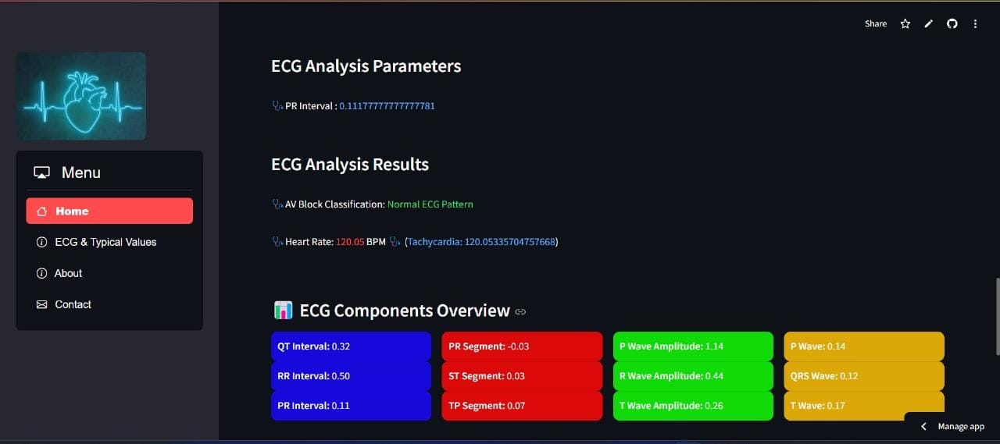

# 🫀 Smart Biomedical Device for Cardiologists

A real-time cardiac monitoring system built using **Raspberry Pi 4B**, **ECG/PPG sensors**, and a **Streamlit web app**. Designed for cardiologists to analyze heart health, detect early signs of heart disease, and monitor vital parameters effortlessly.

---

## 📌 Key Features

- 📡 **Real-time ECG & PPG acquisition** using biosensors
- 🧠 **Digital signal processing** for denoising (band-pass, notch filters)
- 📊 **Feature extraction**:
  - T, P, R peak detection
  - Heart Rate (HR) and Heart Rate Variability (HRV)
  - Pulse Transit Time (PTT)
  - Blood Pressure (BP) estimation
- 🌐 **Streamlit Web App**:
  - Live ECG & PPG graphs
  - Dynamic heart rate updates
  - User-friendly interface for clinicians
- 🛠️ **Raspberry Pi 4B** as the hardware backbone
- 🧬 Future: Heart Attack,Emotion detection and ML-based risk prediction

---

## 🖼️ System Architecture

---

## 🌐 Live Web App

Check out the working web application:  
🔗 [**Streamlit App**](https://ecg-and-ppg-analysis.streamlit.app/)

---

## 🧰 Tech Stack

| Component       | Details                            |
|----------------|------------------------------------|
| Hardware        | Raspberry Pi 4B, ECG Sensor, IR PPG Sensor |
| Programming     | Python                             |
| Signal Analysis | NumPy, NeuroKit2            |
| Visualization   | Streamlit, Matplotlib       |
| Deployment      | Streamlit Cloud        |

---

## 📷 Sample Output

---

